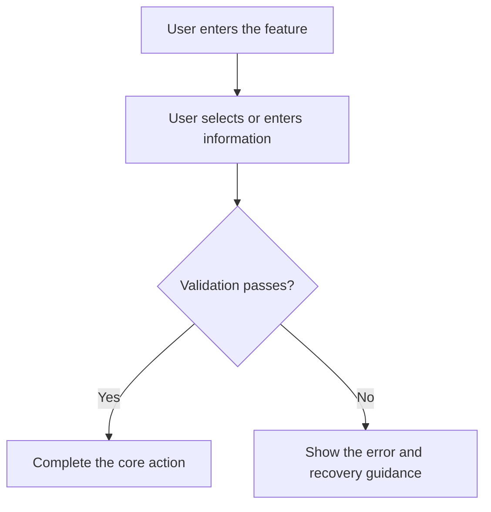

# Product Design Plan Skill

Use this skill to produce a complete, review-ready Chinese product design plan. The document must help stakeholders agree on six questions: **why the product or feature should exist, who it serves, what it includes, how it works, how it will be validated, and how it should evolve**.

## Scope

This skill is primarily for software products, including mobile apps, web products, SaaS products, admin consoles, mini programs, AI products, platform capabilities, plugins, and internal enterprise tools.

If the user explicitly asks for a hardware, industrial, or physical product design plan, keep the same planning logic, but replace software-specific UI and interaction sections with physical structure, materials, manufacturing process, safety, supply chain, quality control, and production constraints.

## Output language rule

Write the final product document in Chinese by default, because this skill is intended for Chinese product design and PRD deliverables. Keep English technical terms only when they are standard product or engineering terms, such as PRD, MVP, Epic, User Story, Acceptance Criteria, Given/When/Then, API, SDK, SaaS, or A/B Test.

If the user explicitly requests another output language, follow the user's requested language while preserving the same structure and quality requirements.

## Core design principles

Apply these principles throughout the plan. Do not list them as slogans without applying them to the proposed product decisions.

1. **Useful and usable**: solve real user problems before optimizing for presentation. Do not trade clarity, efficiency, or accessibility for visual appeal.
2. **Consistent**: keep visual language, interaction logic, naming, state feedback, error handling, and cross-platform behavior consistent so users do not need to relearn the product.
3. **Honest and innovative**: do not exaggerate product capabilities. Innovation is valuable only when it improves problem solving, efficiency, trust, or user experience.
4. **User-centered**: design around user goals, motivations, contexts, and constraints instead of merely listing tasks.
5. **Verifiable and deliverable**: every important feature must have clear rules, boundary cases, error states, and testable acceptance criteria.

## Input interpretation

Before writing the plan, extract the following information from the user's request:

- Product or feature name
- Business background
- Target users
- Target scenarios
- User problems or opportunities
- Business goals and success metrics
- Platform scope, such as app, web, admin console, mini program, API, AI product, or hardware
- Known features, constraints, competitors, reference links, deadlines, and dependencies
- Requested output type, such as short proposal, complete PRD, engineering review draft, MVP plan, feature module specification, or review checklist

If information is missing, continue with explicit assumptions. Mark assumptions as `Assumption` or `To be confirmed` in the final document. Do not stop unless the request lacks enough direction to identify the product, users, or problem space. If clarification is unavoidable, ask only the minimum number of questions needed to proceed.

## Standard design process

Use the following eight-step process as the reasoning backbone. Reflect the important conclusions in the output document; do not simply copy this list into the final answer unless it is useful for the requested format.

1. **Requirement definition**: define the product goal, user problem, business value, scope, and non-scope.
2. **Market and user research**: analyze target users, competitors, alternative solutions, industry practices, and differentiation opportunities.
3. **Concept design**: define the solution direction, core assumptions, MVP scope, and future iteration path.
4. **Prototype design**: describe key pages, key paths, information architecture, and low-fidelity or high-fidelity prototype recommendations.
5. **User validation**: propose feasible validation methods, such as usability testing, interviews, prototype tests, gray release, or A/B testing.
6. **Revision and iteration**: define how feedback should change priority, scope, risks, and implementation sequence.
7. **Specification finalization**: define feature specifications, data rules, interaction states, permissions, copywriting, and acceptance criteria.
8. **Launch and operation**: define engineering handoff, QA, release, operations, monitoring, and post-launch review.

## Default output structure

If the user does not specify a structure, use the complete structure below. If the user asks for a short version, keep every level-1 section but compress each section into concise bullet points.

```markdown
# 《[Product or Feature Name]》Product Design Plan

## 0. Document Information
- Version: v0.1
- Owner:
- Date:
- Target platform:
- Stakeholders: Product / Design / Engineering / QA / Operations / Business
- Status: Draft / In review / Approved

## 1. Background and Goals
### 1.1 Background
### 1.2 User Problem
### 1.3 Business Goals
### 1.4 Success Metrics
### 1.5 Scope and Non-scope

## 2. Users and Market Research
### 2.1 Target Users
### 2.2 Core Scenarios
### 2.3 Competitors or Alternative Solutions
### 2.4 Opportunities and Design Implications

## 3. Product Positioning and Design Principles
### 3.1 Product Positioning
### 3.2 Applied Design Principles
### 3.3 MVP Scope and Iteration Strategy

## 4. Architecture and Flows
### 4.1 Information Architecture
### 4.2 Business Flow
### 4.3 User Journey
### 4.4 State Transitions and Exception Flows

## 5. User Stories and Feature Specifications
### 5.1 Epic List
### 5.2 User Stories
### 5.3 Feature List and Priority
### 5.4 Detailed Feature Specifications

## 6. Interaction, UI/UX, and Copywriting Rules
### 6.1 Page or Module Description
### 6.2 Key Interaction Rules
### 6.3 Visual and Component Consistency
### 6.4 State Feedback and Error Messages
### 6.5 Copywriting Rules
### 6.6 Localization and Accessibility, if applicable

## 7. Data, Permissions, and System Rules
### 7.1 Data Objects and Fields
### 7.2 Roles and Permissions
### 7.3 Rules and Limits
### 7.4 Tracking and Monitoring

## 8. Acceptance Criteria
### 8.1 Global Acceptance Criteria
### 8.2 Feature-level Acceptance Criteria
### 8.3 Boundary and Exception Acceptance Criteria

## 9. Testing and Validation Plan
### 9.1 Prototype Validation
### 9.2 Usability Testing
### 9.3 Gray Release or A/B Test
### 9.4 Post-launch Review Metrics

## 10. Project Plan and Collaboration
### 10.1 Milestones
### 10.2 Dependencies and Risks
### 10.3 Open Questions
### 10.4 Future Iteration Suggestions
```

When writing the actual document, translate the section titles into Chinese unless the user explicitly requests English output.

## Section requirements

### Background and goals

Do not write vague statements such as "improve user experience" without explaining the underlying problem. State all of the following when the information is available or can be reasonably assumed:

- Who has the problem
- In which scenario the problem occurs
- Why the current solution or workaround is insufficient
- What value the solution creates for users
- What value the solution creates for the business
- Which metrics will indicate success, such as conversion rate, completion rate, time spent, retention, satisfaction, error rate, manual processing volume, or support ticket volume

### Architecture and flows

Use Mermaid diagrams or clear text diagrams when actual visual artifacts are not available. A valid flow must include the normal path, important branches, exception paths, and system feedback. Do not show only the ideal happy path.



### User stories and feature specifications

Use this User Story format:

```markdown
- As a [user role], I want to [achieve a goal], so that [I receive a concrete value].
```

Use a feature table when the plan contains multiple modules or functions:

```markdown
| Module | Feature | User Value | Priority | Rules | Dependencies | Notes |
|---|---|---|---|---|---|---|
```

Each detailed feature specification must include entry point, preconditions, user actions, system response, data rules, permission rules, exception states, empty states, loading states, success messages, and failure messages when those items are relevant.

### Interaction, UI/UX, and copywriting

Write executable design rules rather than broad design intentions. Cover the following when relevant:

- Component usage, such as buttons, forms, dialogs, toast messages, empty states, lists, filters, and pagination
- Interaction feedback, including success, failure, loading, disabled, undo, and confirmation states
- Consistency rules for naming, button placement, semantic colors, message format, and cross-platform differences
- Copywriting rules: use concise sentences, start action labels with verbs when appropriate, explain what the user can do next, and make error messages actionable
- Localization rules: include key, Chinese copy, English copy, and context when localization is required
- Accessibility rules: keyboard access, color contrast, focus state, and screen-reader labels when accessibility is relevant

### Acceptance Criteria

Acceptance Criteria must be testable. Avoid vague criteria such as "the page works normally" or "the experience is good".

Prefer Given/When/Then tables:

```markdown
| Scenario | Given | When | Then | Priority |
|---|---|---|---|---|
```

For each core feature, cover normal cases, permission cases, invalid input, network or system failures, empty data, duplicate submission, and boundary values when applicable.

## Output style

- Write in Chinese by default, unless the user explicitly requests another language.
- Use numbered headings with a stable hierarchy.
- Prefer tables, bullet lists, and Mermaid diagrams for content that must be reviewed or implemented.
- Write a practical product document, not marketing copy.
- Mark uncertain content as `Assumption` or `To be confirmed`; never present unsupported external facts as facts.
- If the user provides only a short request, still produce a reviewable first draft and include a final section for missing information.

## Quality checklist

Before finalizing the response, verify that the document satisfies the checklist below. If a checklist item is not applicable, omit it or mark it as not applicable; do not invent content just to fill a section.

- The document states a real user problem and a business value.
- The document defines scope and non-scope clearly enough to prevent engineering misunderstanding.
- The document includes information architecture, business flow, user journey, or an equivalent explanation.
- Epics and User Stories are translated into concrete feature specifications.
- UI/UX, interaction states, copywriting, and consistency rules are included when relevant.
- Permissions, data rules, exceptions, empty states, and loading states are included when relevant.
- Acceptance Criteria are testable and include normal, boundary, and exception cases.
- Dependencies, risks, open questions, and future iteration suggestions are included.
- Assumptions are separated from confirmed facts.
- Product capabilities are described honestly without exaggeration.

## Reference approach

When appropriate, draw on common software product design specifications and mature design systems, such as DingTalk Open Platform product specifications and Youzan Zan Design System. Use these references to support consistency, functional completeness, component standards, and cross-team delivery. Do not copy them mechanically, and do not claim that a specific external standard applies unless the user provided it or it is already known from the project context.
