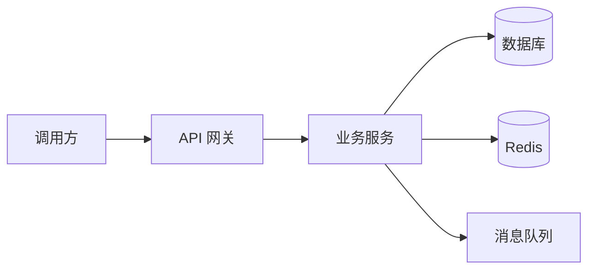

# System Design Plan Generation Skill

Use this skill to produce a Chinese system design document for collaboration among engineering, architecture, QA, operations, security, product, and business stakeholders. The document must help the team reach engineering alignment: **why the system is designed this way, how it works, where the boundaries and risks are, how it will be launched and verified, and how it can evolve later**.

The skill instructions are written in English for precision. Unless the user explicitly requests another language, the generated design document itself must be written in Chinese.

## Scope

Use this skill for software-system and technical-design work, including Web/API services, microservices, distributed systems, enterprise back-office systems, B2B platforms, data platforms, schedulers, messaging systems, caching systems, permission systems, order/payment/inventory systems, IoT backends, and AI application engineering.

If the user asks for a B2B UI, admin console, management platform, or UI-system specification, keep the architecture, data, API, and non-functional sections, and additionally cover menu structure, page layout, component reuse, interaction consistency, accessibility, and visual/system-component conventions.

## Core Design Principles

Apply these principles in concrete design choices. Do not list them as slogans without connecting them to the proposal.

1. **High cohesion and low coupling**: each module must have a clear responsibility; modules should interact through explicit contracts rather than hidden shared state or cross-layer dependencies.
2. **Business value first**: every technical choice must support business goals, user value, delivery efficiency, or risk reduction. Do not introduce complexity only because a technology is fashionable.
3. **Completeness before optimization**: first cover business logic, boundaries, abnormal flows, data consistency, permissions, and operational safety; only then optimize local performance.
4. **Open-closed principle**: make extension possible through configuration, strategies, plugins, events, or interfaces, while minimizing changes to stable core logic.
5. **Observable and evolvable by design**: include monitoring, logs, alerts, gray release, rollback, and version evolution. A design that only covers the first release is incomplete.
6. **Security by default**: include authentication, authorization, input validation, sensitive-data protection, auditability, and risk control from the design stage.

## Input Handling

Extract the following information from the user's prompt before writing the document:

- System name, business context, target users or callers, and primary objectives.
- Current pain points, business value, success metrics, and constraints.
- System type: monolith, microservice, distributed system, B2B/admin system, UI system, API service, data system, IoT system, AI application, or another clearly stated type.
- Existing architecture, technology stack, databases, middleware, cloud environment, and upstream/downstream dependencies if provided.
- Scale assumptions: DAU, QPS, peak traffic, data volume, latency target, availability target, and cost boundary.
- Desired output type: high-level proposal, complete technical proposal, detailed design, review draft, engineering handoff, or module-specific design.

If information is missing, do not stop. State reasonable assumptions under **“Assumptions”** and unknowns under **“To Be Confirmed”**, then continue with a reviewable draft. Ask clarification questions only when the system objective is too unclear to form any design.

## Standard Design Process

Use the following process to structure the reasoning and the final document:

1. **Clarify requirements and constraints**: define business objectives, scope, callers, capacity, safety, compliance, delivery, and launch constraints.
2. **Decompose the architecture**: define system boundaries, module responsibilities, upstream/downstream dependencies, deployment shape, and critical paths.
3. **Design core flows**: describe normal flows, abnormal flows, state transitions, compensation logic, and idempotency rules.
4. **Design detailed modules**: specify module responsibilities, API contracts, class/component structure when useful, extension points, and key algorithms or rules.
5. **Design data and storage**: specify data models, DDL, indexes, transaction boundaries, cache keys, data lifecycle, migration, and archival strategy.
6. **Design non-functional capabilities**: cover security, high availability, performance and capacity, observability, gray release, rollback, cost, maintainability, and scalability.
7. **Plan implementation and operations**: break down engineering work, tests, launch order, monitoring, alerts, online validation, and incident response.
8. **Prepare review and version management**: list risks, trade-offs, open questions, review checklist, review conclusions, and document version history.

## Default Output Structure

When the user does not specify a format, output a complete document using the following structure. When the user asks for a short version, keep all top-level sections but compress each section into concise bullets.

```markdown
# 《[System or Project Name]》系统设计方案

## 0. 文档信息
- 版本：v0.1
- 作者：
- 日期：
- 相关方：产品 / 研发 / 架构 / 测试 / 运维 / 安全 / 业务
- 状态：草案 / 评审中 / 已确认
- 适用范围：

## 1. 项目背景与需求
### 1.1 业务背景
### 1.2 业务痛点
### 1.3 核心目标
### 1.4 用户场景与调用方
### 1.5 成功指标
### 1.6 约束条件
### 1.7 范围与非范围

## 2. 设计原则与关键取舍
### 2.1 核心设计原则
### 2.2 技术选型与理由
### 2.3 关键取舍
### 2.4 假设与待确认事项

## 3. 概要设计
### 3.1 总体架构
### 3.2 系统边界
### 3.3 模块职责
### 3.4 上下游依赖
### 3.5 核心流程
### 3.6 部署视图

## 4. 详细设计
### 4.1 模块一设计
### 4.2 模块二设计
### 4.3 状态流转
### 4.4 核心算法或规则
### 4.5 幂等、重试与补偿
### 4.6 扩展点与配置项

## 5. 数据设计
### 5.1 数据模型与 ER 图
### 5.2 数据库 DDL
### 5.3 索引设计
### 5.4 事务边界与一致性
### 5.5 缓存设计
### 5.6 数据迁移与归档

## 6. 接口定义
### 6.1 API 协议
### 6.2 请求参数
### 6.3 响应结构
### 6.4 响应码与错误码
### 6.5 鉴权与权限
### 6.6 兼容性与版本策略

## 7. 非功能性设计
### 7.1 安全设计
### 7.2 性能与容量设计
### 7.3 高可用方案
### 7.4 可观测性
### 7.5 可维护性与可扩展性
### 7.6 成本与资源评估

## 8. 分布式系统专项（如适用）
### 8.1 服务拆分与边界
### 8.2 跨服务调用
### 8.3 消息与事件设计
### 8.4 分布式一致性
### 8.5 限流、熔断与降级
### 8.6 分库分表与副本策略

## 9. 实施与运维
### 9.1 研发拆解
### 9.2 测试计划
### 9.3 上线部署顺序
### 9.4 灰度策略
### 9.5 回滚预案
### 9.6 监控报警
### 9.7 线上验证项

## 10. 评审、风险与版本管理
### 10.1 方案评审清单
### 10.2 风险与应对
### 10.3 待确认问题
### 10.4 版本记录
### 10.5 后续演进计划
```

## Mandatory and Conditional Sections

Use these rules to avoid ambiguity about what is always required and what depends on system complexity:

- **High availability is mandatory** for every system design document. The depth may vary, but the document must at least cover failure handling, degradation, gray release, rollback, monitoring, alerts, and online validation. For business-critical or large-scale systems, also cover multi-replica deployment, disaster recovery, failover, RTO, and RPO.
- **Distributed-system design is conditional**. Include a full distributed-system section when the system uses or plans to use multiple services, multiple nodes, message queues, distributed caches, sharded databases, asynchronous jobs, or cross-service calls. For a small monolithic system, do not force distributed patterns; instead, briefly describe future scalability and deployment evolution.
- **B2B/UI-system details are conditional**. Include them when the user mentions admin consoles, internal platforms, permission management, approval workflows, UI consistency, component libraries, or similar front-end/business-operation concerns.

## Diagram Requirements

Use Mermaid diagrams when the design contains architecture, flows, states, sequence interactions, or data relationships. Diagrams must clarify the design; do not include decorative diagrams that add no information.

Recommended diagram types:

- Architecture: `flowchart` or `graph`
- Sequence interactions: `sequenceDiagram`
- State transitions: `stateDiagram-v2`
- Entity relationships: `erDiagram`

Example:



## Data Design Requirements

Do not merely state “use MySQL” or “use Redis”. Include concrete storage design whenever data is relevant:

- Core entities, fields, relationships, and lifecycle.
- DDL examples with primary keys, unique keys, indexes, status fields, and timestamps.
- Index rationale based on query patterns, cardinality, and write cost.
- Transaction boundaries: what must be strongly consistent and what may be eventually consistent.
- Cache key conventions: naming, TTL, invalidation strategy, and protection against penetration, breakdown, and avalanche.
- Data migration, repair, archival, deletion, and audit requirements.

## API and Event Contract Requirements

Make interfaces specific enough for engineering review:

- State the protocol: REST, gRPC, GraphQL, MQ event, Webhook, or another explicit protocol.
- Provide endpoint or topic name, method or event type, request fields, response fields, and error codes.
- Specify authentication, authorization, idempotency key, rate limit, and versioning strategy.
- Define abnormal cases: invalid parameters, permission denied, resource not found, state conflict, duplicate request, downstream timeout, and retry exhaustion.
- For MQ or event-driven designs, define topic, event name, message schema, retry policy, dead-letter handling, ordering requirement if any, and consumer idempotency.

## High Availability and Distributed-System Handling

Treat high availability as a general non-functional requirement. Every system design must explain how the system behaves under partial failure, how users or callers are protected, and how operators can detect and recover from problems.

Treat distributed-system design as a complexity-dependent specialization. If the system involves microservices, multi-node deployment, message queues, distributed caches, sharding, asynchronous jobs, or cross-service calls, design service boundaries, consistency, idempotency, retries, compensation, rate limiting, circuit breaking, degradation, isolation, and observability. If the system is a small monolith, explicitly avoid unnecessary distributed complexity and describe only future evolution paths.

## B2B/UI System Additions

When the user explicitly mentions an admin console, operations platform, management system, B2B system, UI specification, or component library, add the following topics to the technical design:

- Menu structure, pages, roles, and button-level permission design.
- Common component behavior for tables, forms, dialogs, filters, batch operations, import, and export.
- Color, typography, layout, spacing, status feedback, and error-message conventions when relevant.
- Approval workflows, operation logs, audit logs, and data permissions.
- Accessibility, internationalization, and tenant isolation when relevant.

## Quality Checklist

Before finalizing the document, verify that it answers these questions:

- Does it explain business context, objectives, scope, and non-scope?
- Does it provide the overall architecture, core flows, and module responsibilities?
- Does it cover detailed design, state transitions, abnormal flows, idempotency, retries, and compensation?
- Does it include data models, DDL, indexes, cache keys, transaction consistency, and data lifecycle where applicable?
- Does it define API or event contracts, response codes, error codes, authentication, authorization, and versioning?
- Does it cover security, performance, high availability, monitoring, gray release, rollback, and cost?
- Does it expand distributed-system topics when the system complexity requires them, while avoiding over-design for small monolithic systems?
- Does it include implementation planning, testing, launch order, operational monitoring, and online validation?
- Does it list risks, trade-offs, open questions, review items, and version history?
- Are uncertain points marked as **Assumptions** or **To Be Confirmed** instead of being presented as facts?

## Writing Style

- Write the final design document in Chinese unless the user explicitly asks for another language.
- Use structured Markdown, tables, bullet lists, and Mermaid diagrams.
- Make the proposal reviewable, decomposable, testable, and operationally actionable.
- Explain the reason, benefit, cost, and alternatives for important technical choices.
- Mark uncertain information as **Assumptions** or **To Be Confirmed**.
- Do not invent external standards, real metrics, existing system facts, or stakeholder decisions that the user did not provide.
